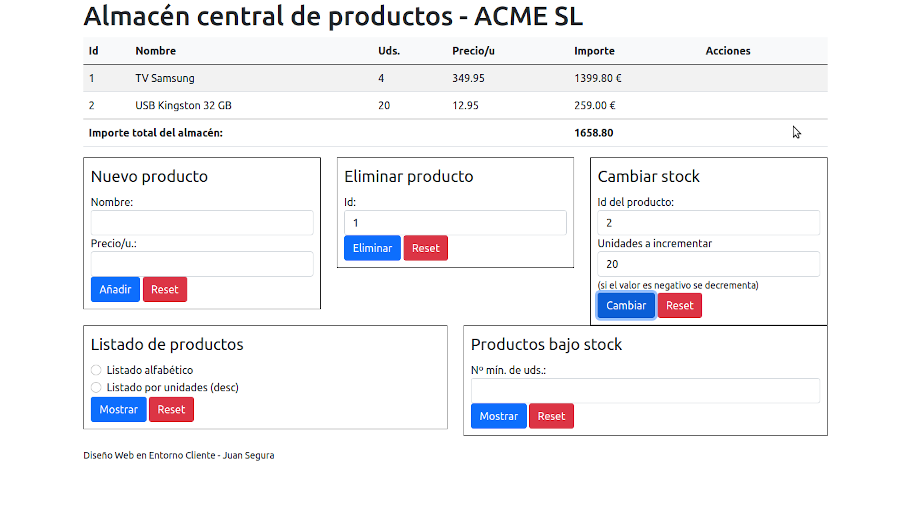

# Bloc 1: Javascript. Práctica 4.1 - DOM
Siguiendo con la práctica de 'Productos de un almacén' vamos a crear una página donde mostrar en una tabla los productos de nuestro almacén. Cada fila corresponderá a un producto y se mostrará su id, nombre, unidades, precio por unidad e importe. En el fichero index.html tenéis el esqueleto de nuestra vista, que usa **_bootstrap_** para mejorar la presentación. La página está dividida en 3 zonas:
- Una tabla vacía con id _almacen_ donde pintaremos ese almacén (cada producto en una fila)
- En su TFOOT el importe total del almacén en una celda con id _total_
- Un div para modificar el almacén, que contiene 3 formularios:
    - **new-prod**: formulario para añadir nuevos productos al almacén. Debéis modificarlo para que tenga un input para introducir el nombre (obligatorio, al menos 3 caracteres) y otro para el precio (número mayor o igual que 0 y con 2 decimales) además de los botones de 'Enviar' y 'Reset'
    - **del-prod**: formulario para borrar un producto. Tendrá un input para introducir su id (obligatorio, debe ser un número entero positivo)
    - **stock-prod** (lo tenéis hecho para que os sirva de modelo): formulario para modificar el stock de un producto (cuando se da de alta será de 0 uds.). Tendrá un input para introducir su id (obligatorio, número entero positivo) y otro para el nº de uds. a añadir o eliminar (obligatorio, número entero)
- Un div para obtener listados del almacén, que se mostrarán en una nueva ventana. Contiene 2 formularios más (ya los tenemos hechos):
    - **list-prod**: para mostrar el listado de productos del almacén. Hay que indicar si lo queremos por unidades o alfabético y pulsar el botón
    - **low-prod**: para mostrar el listado alfabético de productos con menos uds. de las indicadas en este formulario

Para esta aplicación seguiremos el patrón **MVC**. Ya tenemos creadas las clases _Product_ y _Store_ con sus funcionalidades por lo que la lógica de negocio de nuestra aplicación (el modelo) la tenemos ya hecha. Ahora nos falta crear funciones con las que interactuará el usuario y que se encargarán de modificar los datos usando las clases ya creadas y reflejar los cambios hechos en la página para que los vea el usuario. 

El usuario interactúará con la aplicación usando los formularios que hay bajo la tabla. Para mejorar su presentación hemos usado _bootstrap_ por lo que cada input del formulario tiene la siguiente estructura básica:
```html
<div class="form-group">
    <label for="newprod-name">Nombre: </label>
    <input type="text" class="form-control" id="newprod-name">
</div>
```

Respecto a los botones de cada formulario tienen el siguiente aspecto:
```html
<button type="submit" class="btn btn-default btn-primary">Añadir</button>
<button type="reset" class="btn btn-secondary">Reset</button>
```



## Organización del código
Dentro de la carpeta **src/** tenemos los ficheros:
- **index.js**: es el fichero principal de nuestra aplicación que importa la clase _Controller_ e instancia un nuevo controlador. Además contiene las funciones manejadoras de eventos de los formularios (las que escuchan para ver cuándo se envía un formulario y en ese caso recoge los datos y se los pasa al controlador)
- **controller/controller.class.js**: la clase _Controller_ con sus propiedades y métodos
- **view/view.class.js**: la clase _View_ con sus métodos
- **model/**: carpeta donde pondremos las clases Store y Product que tenemos en los ficheros **store.class.js** y **product.class.js** que ya tenemos hechas

Para no tener que enlazar en el _index.html_ los 5 ficheros en el orden correcto (product, store, view, controller y index) vamos a seguir haciendo uso de _webpack_ para que se empaqueten todos nuestros ficheros en un único fichero que se llamará _./dist/main.js_ y sera el que se enlaza en el _index.html_.

## Tareas a realizar
### Creación del proyecto (ya hecho)
Esta vez no hay que hacer nada porque ya tenemos el fichero _package.json_. Sólo es necesario ejecutar el `npm install` para que se descargue las dependencias en la carpeta _node_modules_. 

Si tuviéramos que partir de un nuevo proyecto vacío lo que habría que hacer es:

1. Inicializar el proyecto (cuando pregunte la librería para test le debemos decir **jest**)
```bash
npm init
```

2. Instalar las dependencias (todas son de desarrollo). Si tienes _jest_ instalado global no hace falta que lo añadas como dependencia
```bash
npm i -D webpack webpack-cli jest
```

Cada vez que modifiques tu código, si quieres ver esos cambios en el navegador, debes ejecutar _webpack_ para que vuelva a generarse el fichero **dist/main.js** que es el que tenemos enlazado en _index.html_
```bash
npx webpack --mode=development
```

Y para pasar los tests sólo hay que ejecutar
```bash
npm run test
```

### Completar los formularios
Debemos crear los inputs necesarios en los formularios así como los botones de enviar el formulario (tipo 'submit') y borrarlo (tipo 'reset'). Recordad añadir los atributos necesarios para que se validen por HTML. También es conveniente ponerle una _id_ a cada campo para que sea más sencillo acceder a ellos desde el código.

### Hacer el fichero principal _index.js_
Aquí importaremos la clase del controlador (`require`) y crearemos la instancia del controlador de nuestra aplicación y la inicializaremos.

Además crearemos funciones manejadoras de eventos que se ejecutarán automáticamente cuando se envíe cada formulario. Dichas funciones se ocupan de recoger los datos del formulario y enviarlos a la función correspondiente del controlador. Reciben como parámetro un objeto _event_ con información sobre el evento producido y su primera línea será `event.preventDefault()` para que no se recargue la página al enviar el formulario (en el tema de _Eventos_ veremos el por qué de todo esto). 

Tenéis hecha la función para el formulario _form-prod_ que debéis completar para que coja los datos  del formulario y se los pase al método del controlador encargado de añadir un nuevo producto (_addProductToStore_)

Tenéis que completar también las otras 2 funciones para manejar los formularios de eliminar productos y cambiar unidades siguiendo ese ejemplo y crear las de los formularios de mostrar los listados.

### Hacer el controlador _controller.class.js_
Como se explica en la teoría,la clase controller tendrá 2 propiedades (deben llamarse así para pasar los tests):
- **store**: será un almacén (una instancia de la clase _Store_) donde guardar los datos. En nuestro caso crearemos un almacén con id 1.
- **view**: será una instancia de la clase _View_ a la que llamar para renderizarlos

Además el controlador tendrá métodos para responder a las distintas acciones del usuario: añadir productos, eliminarlos y cambiar sus unidades. Lo que debe hacer cada método es:
1. lo primero sería validar los datos que le han pasado. Sim embargo como ya tenemos implementada esa funcionalidad en la clase _Store_ la dejaremos allí y simplemente llamamos a los métodos de _Store_ con los parámetros que nos hayan pasado, sin comprobarlos, por lo que **no hay que hacer nada en el punto 1**
2. llamar al modelo (la clase Store) para modifique la información en respuesta a la acción del usuario (en realidad sólo habría que hacerlo tras comprobar los datos pero los comprobarán los métodos de _Store_)
3. 
  - **a)** si el modelo cambia los datos hay que llamar a la vista para que modifique la tabla de productos y refleje los cambios hechos
  - **b)** si ha habido algún problema o hay algún error debe llamar a la vista para mostrar el error al usuario

Los métodos del controlador serán:
- **addProductToStore**: recibe de la función manejadora del formulario _new-prod_ **un objeto** con los datos del producto a añadir (_name_, _price_ y _units_) y hace que se añada al almacén y se muestre en la tabla
- **deleteProductFromStore**: recibe de la función manejadora del formulario _del-prod_ la id del producto a eliminar y hace que se borre del almacén y de la tabla. Deberá pedir **confirmación** (le mostraremos al usuario la id del producto a eliminar y su nombre). Si el producto tiene unidades en stock, pedirá una **segunda confirmación** donde le indicaremos las unidades que aún tiene y le diremos que desaparecerán si acepta
- **changeProductStock**: recibe de la función manejadora del formulario _stock-prod_ **un objeto** con la id del producto a modificar y las unidades a sumarle (número entero positivo o negativo) y se encarga de que se cambien en el almacén y se muestren los cambios en la tabla
- **changeProductInStore**: recibe **un objeto** con la id del producto a modificar y las propiedades del mismo que deseamos modificar (las no incluidas permanecerán inalteradas). Se encarga de modificar el producto en el almacén y que se muestren en la tabla esos cambios

### Hacer la vista _view.class.js_
Esta clase se encarga de mostrar en la página la información que recibe para lo que tendrá métodos para mostrar los productos así como un método para mostrar mensajes al usuario sin tener que usar alerts.

Los métodos que contendrá son:
- **renderNewProduct**: recibe un objeto Product y lo añade al final de la tabla
- **renderDelProduct**: recibe una id de un producto y borra de la tabla la fila de dicho producto
- **renderEditProduct**: recibe un objeto Product que ya está pintado y modifica en la tabla su fila para mostrar los nuevos datos
- **renderStoreImport**: recibe un número y lo muestra como importe total de la tabla

Tenéis que tener en cuenta que:
- no podéis volver a renderizar toda la tabla, sólo hay que cambiar lo que nos dicen porque el renderizado es lo que más consumo de recursos hace y no queremos perjudicar el rendimiento de nuestra aplicación (imaginad una tabla con muchos productos...)
- por tanto en ningún momento podemos cambiar el innerHTML de la tabla ni de su BODY. Sólo podemos añadir, eliminar o modificar TR
- recordad que bajo la tabla hay un TOTAL del importe del almacén que siempre debe estar actualizado

Además de los anteriores tendrá un método llamado **renderErrorMessage** al que se le pasa un texto y añade dentro del DIV con _id_ **messages** un nuevo DIV con el mensaje a mostrar al usuario, cuyo HTML será
```html
<div class="col-sm-12 alert alert-danger alert-dismissible fade show">
    <span><strong>ATENCIÓN: </strong>Aquí pondremos el texto que queramos mostrar</span>
    <button type="button" class="btn-close" data-bs-dismiss="alert" onclick="this.parentElement.remove()"></button>
</div>
```

Fijaos que el botón tiene un atributo _onclick_ cuyo valor es el código Javascript que borra este DIV. No es lo más correcto pero de momento lo haremos así.

# Práctica anterior:
# Bloc 1: Javascript. Práctica 3.1 - POO
En este ejercicio vamos a trabajar con los productos de un almacén, para lo que crearemos las clases **Product** y **Store**.

## Clase Product
La guardaremos en el fichero _product.class.js_. Tendrá las siguientes **propiedades**:
  - **id**
  - **name**
  - **price**
  - **units**: argumento opcional (si no le pasamos este parámetro al constructor su número por defecto será 0).
  
Esta clase tendrá los siguientes **métodos**:
  - **changeUnits**: recibe el número de unidades a añadir al objeto (debe ser un entero positivo para aumentar, o negativo para disminuir unidades). Devolverá el producto modificado. Si se intentan restar más unidades de las que hay no resta nada y genera un error.
  ```javascript
  changeUnits(units: Integer): Product
  ```    
  - **productImport**: devuelve el importe total del producto (su precio multiplicado por el nº de unidades)
  ```javascript
  productImport(): Number
  ```  
  - **xxxx** (¿qué nombre le deberías dar a este método?): si se intenta **imprimir** el producto se mostrará su descripción, sus unidades entre paréntesis, su precio y el importe total (los € siempre con 2 decimales) como en el siguiente ejemplo:
```html
        TV Samsung MP45: 10 uds. x 235,95 €/u = 2359,50 €
```

  ```javascript
  xxxx(): String
  ``` 

## Clase Store
Es el almacén de productos (podríamos tener más de uno) que guardaremos en _store.class.js_. Tendrá las **propiedades**:
  -  **id**: código numérico que nos pasan al crear el almacén
  -  **products**: array de productos. No se le pasa al constructor sino que al crear un almacén se inicializa a un array vacío.
  
La clase tendrá los **métodos**:
  - **findProduct**: recibe como parámetro una id de producto y devuelve el producto del almacén que tiene dicha id (si no existe devolverá _undefined_)
  ```javascript
  findProduct(id: Integer): Product|undefined
  ```
  - **addProduct**: recibe como **único** parámetro **un objeto** con los datos del producto a añadir (propiedades _name_, _price_ y, opcionalmente, _units_, no _id_). Este método crea un nuevo producto (llamará al constructor de la clase _Product_) y lo añade al almacén. Como a la clase _Product_ hay que pasarle una _id_ haremos una función que la calcule buscando la máxima _id_ de los productos que hay en el almacén (debéis usar un _reduce_) y sumándole 1. Este método devuelve el producto añadido al almacén o genera un error si
    - no se le pasa _name_
    - no se le pasa _price_ o no es un número positivo
    - se le pasa _units_ pero no es un número entero positivo
  ```javascript
  addProduct(data: Object): Product
  ```
  - **delProduct**: recibe como parámetro la id de un producto y, si no tiene unidades, lo elimina del almacén y devuelve el producto eliminado. Genera un error si no existe el producto o si sus unidades no están a 0
  ```javascript
  delProduct(id: Integer): Product
  ```
  - **changeProduct**: recibe como **único** parámetro **un objeto** con la id de un producto y uno o más campos a modificar con sus nuevos valores (los campos que no se pasan permanecerán sin cambios). Devuelve el objeto modificado si ha podido hacerse o genera un error en caso contrario
  ```javascript
  changeProduct(data: Object): Product
  ```
  - **changeProductUnits**: recibe como parámetros la id de un producto y el número de unidades a incrementar (o disminuir si el número es negativo). Devuelve el producto modificado si ha podido hacerse o generará un error en caso contrario
  ```javascript
  changeProductUnits(id: Integer, units: Integer): Product
  ```  
  - **totalImport**: devuelve el valor total de los productos del almacén (su precio por sus uds). Para ello usa el método _productImport_ de cada producto
  ```javascript
  totalImport(): Number
  ```    
  - **underStock**: recibe un nº de unidades y devuelve un array con los productos que tengan menos de dichas unidades
  ```javascript
  underStock(units: Integer): Array
  ```    
  - **orderByUnits**: devuelve el array de productos ordenado por unidades de forma descendente
  ```javascript
  orderByUnits(): Array
  ```    
  - **orderByName**: devuelve el array de productos ordenado por el nombre del producto
  ```javascript
  orderByName(): Array
  ```    
  - **xxxx** (¿qué nombre le deberías dar a este método?): si se intenta imprimir el almacén devuelve una cadena con la id del almacén, el nº de productos y su importe total con 2 decimales, y debajo una lista con los datos de cada producto como en el siguiente ejemplo:
```html
Almacén 1 => 2 productos: 2174,75 €
- TV Samsung MP45: 10 uds. x 235,95 €/u = 2359,50 €
- USB Kingston 16 GB: 100 uds. x 19,95 €/u = 1995,00 €
```

  ```javascript
  xxxx(): String
  ```  

## Organizar el código: webpack
Lo correcto es no tener todo el código en un único fichero javascript sino cada cosa en su fichero correspondiente. Así que dentro de la carpeta **src/** crearemos los ficheros:
- **product.class.js**: la clase _Product_ con sus propiedades y métodos
- **store.class.js**: la clase _Store_ con sus propiedades y métodos
- **index.js**: el programa principal que crea el almacén, lo modifica (añade, elimina y modifica productos) y muestra por consola su contenido

En el _index.html_ habría que enlazar los 3 ficheros en el orden correcto (productos, almacén y index para que desde _index.js_ se pueda llamar a métodos de _Store_ y desde _store.js_ a métodos de _Product_). Como esto ya empieza a ser incómodo vamos a hacer uso de **_webpack_** para que empaquete todos nuestros ficheros javascript en un único fichero que se llamará _./dist/main.js_ y que será el único que enlazaremos en el _index.html_. Consulta [cómo usar webpack](../12-tests.html#usando-webpack) para hacerlo. 

Lo que habría que hacer (no lo hagas, ya tienes el _package.json_) es:
- `npm init`: inicializamos nuestro proyecto lo que creará el fichero **package.json**. Recuerda escribir **jest** cuando nos pregunte por los tests
- `npm i -D webpack webpack-cli`: instalamos _webpack_ como dependencia de desarrollo (en la versión de producción no estará)
- 
En este ejercicio ya tienes el _package.json_ creado y configurado por lo que lo único que tienes que hacer es que se instalen las dependencias (`npm install`). Una vez hecho:
- para pasar los test ejecuta `npm run test`
- cuando quieras probarlo en el navegador ejecuta `npx webpack --mode=development`: esto crea el fichero **dist/main.js** (el que está enlazado en el _index.html_) donde mete el código de todos nuestros ficheros javascript. Deberás ejecutarlo cada vez que hagas cambios en tu código y quieras probarlos en el navegador

Fijaos en el código que os paso. Para que la clase _Store_ pueda usar los métodos de _Product_ debemos hacer:
- añadir al final deconst Store = require('./store.class');

 _product.class.js_ el código `module.exports = Product`. Esto hace accesible la clase a cualquier fichero que importe _product.class.js_. Es lo mismo que hacíamos en los ficheros _functions.js_ de los ejercicios anteriores para que los tests pudieran acceder a sus funciones
- añadir al principio de _store.class.js_ el código `const Product = require('./product.class')`. Crea una variable _Product_ que es la clase exportada en el otro fichero

Lo mismo tendréis que hacer para que _index.js_ pueda llamar a métodos de _Store_ (exportar la clase en _store.class_ e importar ese fichero en _index_).

## Probar el código
En la carpeta _test_ ya tienes hechos varios test que puedes pasar para comprobar tu código. Recuerda que simplemente debes hacer:
```javascript
npm run test
```

Para probar que funciona en el navegador añade al fichero _index.js_ el código necesario para:
- crear un almacén
- le añade los siguientes 4 productos:
  - 'TV Samsung MP45', 345.95 €, 3 uds. 
  - 'Ábaco de madera', 245.95 €
  - 'impresora Epson LX-455', 45.95 €
  - 'USB Kingston 16GB', 5.95 €, 45 uds.
- cambia los siguientes productos:
  - a la TV le cambiamos el precio por 325.90 y sus unidades pasarán a ser 8
  - al ábaco le sumamos 15 uds
  - a la impresora le ponemos de precio 55.90 y de unidades -2
  - a la TV le restamos 10 unidades
  - al ábaco le cambiamos el nombre por 'Ábaco de madera (nuevo modelo)'
- mostrar por consola el almacén
- mostrar por consola el texto 'LISTADO DEL ALMACÉN alfabético'
- mostrar por consola el almacén ordenado alfabéticamente
- eliminar la TV
- eliminar la impresora
- mostrar por consola 'LISTADO DEL ALMACÉN por existencias'
- mostrar por consola el almacén ordenado por existencias
- mostrar por consola 'LISTADO DE PRODUCTOS CON POCAS EXISTENCIAS'
- mostrar por consola los productos del almacén con menos de 10 unidades

Recuerda que siempre que llames a una función que pueda generar un error debes hacer dicha llamada dentro de una sentencia `try...catch`. Lo que haremos en _index.js_ si captura un error es mostrarlo por consola con el comando `console.error`.

Al abrir la página en el navegador la consola deberá mostrar lo siguiente:

```
Almacén 1 => 4 productos: 6564.20 €
- TV Samsung MP45: 8 uds. x 325.90 €/u = 2607.20 €
- Ábaco de madera (nuevo modelo): 15 uds. x 245.95 €/u = 3689.25 €
- impresora Epson LX-455: 0 uds. x 45.95 €/u = 0.00 €
- USB Kingston 16GB: 45 uds. x 5.95 €/u = 267.75 €
LISTADO DEL ALMACÉN alfabético
- Ábaco de madera (nuevo modelo): 15 uds. x 245.95 €/u = 3689.25 €
- impresora Epson LX-455: 0 uds. x 45.95 €/u = 0.00 €
- TV Samsung MP45: 8 uds. x 325.90 €/u = 2607.20 €
- USB Kingston 16GB: 45 uds. x 5.95 €/u = 267.75 €
LISTADO DEL ALMACÉN por existencias
- USB Kingston 16GB: 45 uds. x 5.95 €/u = 267.75 €
- Ábaco de madera (nuevo modelo): 15 uds. x 245.95 €/u = 3689.25 €
- TV Samsung MP45: 8 uds. x 325.90 €/u = 2607.20 €
LISTADO DE PRODUCTOS CON POCAS EXISTENCIAS
- TV Samsung MP45: 8 uds. x 325.90 €/u = 2607.20 €
```

y además 3 mensajes de error debido a que:
- se pasan unidades negativas (-2) a _changeProduct_ al cambiar los datos de la impresora
- se intentan restar más unidades (10) de las que quedan (8) a la TV
- se intenta borrar el producto 1 y le quedan 8 unidades

**NOTA**: cuando acabes tu práctica mira el código que genera webpack (dist/main.js). Ahora vuelve a generarlo pero esta vez para producción (`--mode=production`) y fíjate de nuevo en el código del fichero. 
